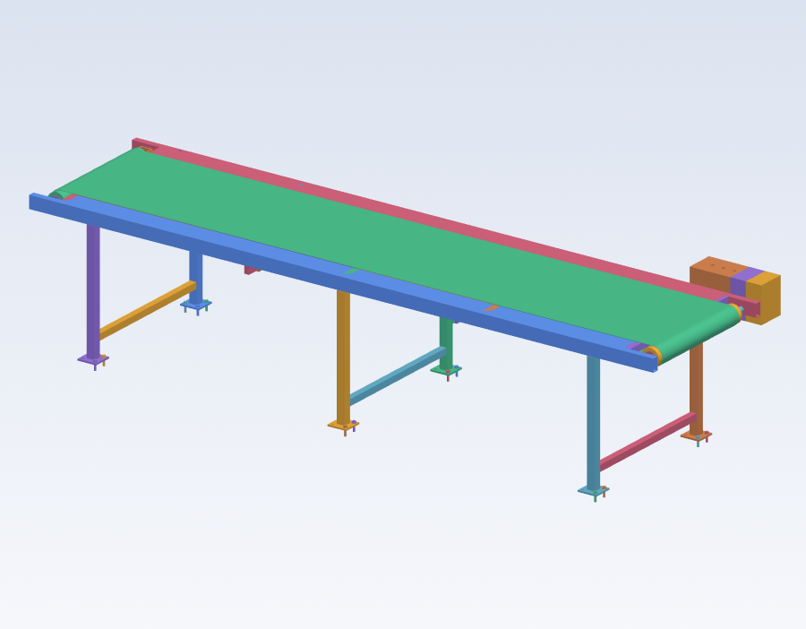
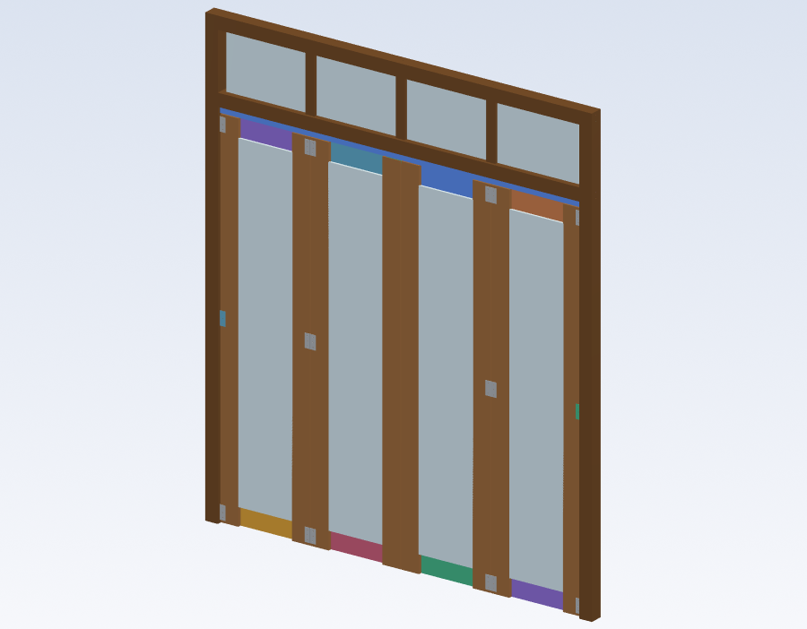

**English** · [Español](README.es.md)

<p align="center">
  
</p>

<h1 align="center">Genix Apolo CAD</h1>

<p align="center">
  <b>An <i>agent-native</i> 3D parametric CAD for industrial machinery.</b><br>
  Built to be <b>driven by an AI agent</b> (Claude Opus or others) over <b>MCP</b> — or by hand in your browser.
</p>

<p align="center">
  
  
  
  
  
</p>

---

## What it is

Apolo is a **headless** parametric CAD for designing real machines. Its edge **isn't the kernel**
(it uses OpenCascade, like FreeCAD) but its **agent-native architecture**:

> Every operation is a **command** against an API. The whole document is an editable **command
> log**. And the same JSON Schemas that generate the UI also generate the **agent's tools**. One
> single source of truth.

The upshot: an AI agent can **design complete machines end to end** —not just autocomplete— and
**verify them**: detect interferences, simulate gravity, look at a render (vision) and emit
fabricable shop drawings. It's STEP-interoperable, drivable by a human **or** an AI, and usable as
a **headless backend** that other tools/agents call.

**MVP vertical:** conveyors / material handling.

## What makes it different

- 🤖 **Genuinely agent-native.** Not a chatbot bolted onto a CAD: the agent is a first-class
  client of the same API as the UI. It designs, measures, validates and fixes on its own.
- 🧾 **Document = command log** (event-sourced). Geometry is never stored → KB-sized files, free
  undo/redo, parametric editing of any past command.
- 🧬 **Schema-driven.** Adding a command to the registry makes it appear in the toolbar, the
  dialogs, the properties panel **and** the agent's tools — without touching anything else.
- 🔢 **Variables and expressions.** Any numeric field accepts `"=expression"` (`=width-2*profile`).
  Changing a variable regenerates the whole model.
- 🎯 **Declarative edge/face selectors** (by direction, face, length, proximity) — goodbye to the
  fragile *topological naming problem*.
- 🧱 **Machine templates = super-commands** (e.g. `create_belt_conveyor`, `create_take_up`): they
  inherit parametric editing, undo, BOM and agent exposure for free.

## How to use it

### ▶ Via an AI agent (MCP) — the primary way

You mostly operate Apolo **by talking to an agent**. It exposes **54 MCP tools**, so any
MCP-compatible client (Claude Code, Claude Desktop, etc.) running a capable model —**Claude Opus**
or others— can design entire machines. The repo ships a `.mcp.json`:

```jsonc
{
  "mcpServers": {
    "apolo-cad": {
      "command": ".venv/Scripts/python.exe",
      "args": ["-m", "apolo.mcp_server"],
      "env": { "APOLO_URL": "http://127.0.0.1:8000" }
    }
  }
}
```

With the server up, you ask your agent in plain language:

> *"Design a 4 m × 600 mm belt conveyor for 1–15 kg parcels, with a hollow-shaft gearmotor and
> gravity-type take-up tensioning. Check there are no interferences and show me a render."*

And the agent:
1. **Models** with `run_batch` (**atomic** batches: one regenerate, one undo step), referencing
   parts from the same batch with `$k` and dimensions with `=expression`.
2. **Perceives** with `render_view` (returns an image → *vision*), `get_topology`, `measure`.
3. **Validates** with `check_interference`, `engineering_check`, `gravity_test` (simulates what
   falls).
4. **Documents** with `drawing` / `drawing_set` / `assembly_manual` → shop drawings, cut lists,
   BOMs and step-by-step assembly manuals.

The **write core is minimal** (`run_command` / `run_batch` / `edit_command` + `undo`/`redo` +
`set_variable`) and covers the **entire** command registry — there is no tool per command. The
rest of the 54 tools are for reading, perception, drawings and validation. Everything the agent
does lives in the log: editable, undoable and reproducible. Changes show up **live** in the
browser.

### 🖱 By hand (web UI)

A three.js viewport with PBR materials, shadows and a ViewCube; a schema-driven ribbon (Create /
Sketch / Modify / Assemble / Library / Robotics); a parametric properties panel; "pro CAD"
shortcuts (move/rotate with snap, isolate, fit, measure, section). The agent and the UI are **two
equal clients** of the same API: what one does, the other sees.

## Gallery

| Belt conveyor (the MVP vertical) | Folding door — wood + translucent glass |
|---|---|
|  |  |

*Shaded renders produced by the engine itself (`render_view`, VTK) — the same ones the agent uses
to visually self-review.*

## Architecture

```
   AI agent (MCP) ───┐        ┌── React + three.js (web UI)        equal clients
                     ▼        ▼                                    of the same API
                core/apolo/api      FastAPI · REST + WebSocket
                     │
                     ▼
   doc        document = command log (event-sourced · undo/redo · KB-sized .apolo)
   commands   command registry + JSON Schemas  (single source of truth)
   kernel     build123d / OpenCascade  (B-rep geometry, render, measure, picking)
   library    catalog (191 refs) · BOM · machine super-commands
   assembly   joints · mates · constraints · connectivity / gravity
   drawing    pro 2D drawings  (HLR → SVG/DXF/PDF · sections · dimensions · drawing sets)
   physics    gravity / stability  (MuJoCo)
```

Clean, non-negotiable boundaries: `kernel` (pure geometry) ⟂ `commands/registry` (operations +
schemas) ⟂ `doc` (log/state) ⟂ `api` (transport) ⟂ `agent`/`mcp` (AI clients) ⟂ `ui`. Designed to
scale (many commands, modules and clients).

## Capabilities

- **Modeling** — primitives, fillet/chamfer/shell/drill, patterns, mirror, revolve, extrude,
  **sweep/loft** (incl. closed loops and helix), **sheet metal** with flat-pattern DXF/SVG export,
  **constrained 2D sketching** (in-house scipy solver), **STEP** import.
- **Assembly & kinematics** — **persistent face mates** (re-solved on edit), **joints**
  (fixed/revolute/continuous/prismatic), **rail and N-DOF constraints**, **motion study** (animate
  the joints and scan collisions along the path).
- **Library & BOM** — a **191-reference catalog** populated from real **standard** dimensions
  (ISO/ASTM/DIN/EN: bearings, profiles, fasteners, joinery, hardware…) + super-commands
  (`create_belt_conveyor`, `create_weldment`, `create_frame`, `create_sheet_metal`,
  `create_take_up`, `create_drive_roller`, robot arm). BOM with cut list and CSV export.
- **Engineering validation** — `engineering_check` (vertical rules: belt speed, motor torque,
  support…), `check_interference` (OCCT booleans), and **gravity-based assembly validation**
  (declare joints/grounds and simulate *what falls* with convex hulls in MuJoCo).
- **PRO manufacturing drawings** — HLR projections → SVG/DXF/PDF, dimensions with arrows and
  tolerances, **A-A/B-B sections** with per-material hatching, **detail views**, **title block** +
  revisions, full **drawing sets**, **automatic hole dimensioning**, **exploded views**, light
  GD&T, step-by-step **assembly manuals**, and an **Inventor-style color shaded iso**. All from a
  **declarative spec** (`drawing(spec)`) the agent composes.
- **AI** — MCP server (54 tools), **vision** rendering, agent session memory, chat auto mode
  (execute → verify → fix).

## Requirements

- Python 3.11–3.13 (with OCP/build123d binary wheels)
- Node.js 18+
- *(Optional)* An Anthropic API key (`ANTHROPIC_API_KEY`) for the AI assistant embedded in the UI

## Installation

```powershell
# Python core
python -m venv .venv
.venv\Scripts\python -m pip install -e core
.venv\Scripts\python -m pip install pytest httpx   # for the tests

# UI
cd ui
npm install
npm run build    # builds ui/dist, served by the server itself
```

## Running it

```powershell
$env:ANTHROPIC_API_KEY = "sk-ant-..."   # optional (UI's AI assistant)
.venv\Scripts\python -m uvicorn apolo.api.main:app --port 8000
```

Open <http://localhost:8000>. To connect an **agent over MCP**, keep the server running and point
your MCP client at the repo's `.mcp.json`. Optional env vars: `APOLO_MODEL` (default
`claude-opus-4-8`), `APOLO_DB` (SQLite path).

## Tests

```powershell
.venv\Scripts\python -m pytest tests -q   # 527 tests
```

They cover the kernel (per-command volumes/bboxes), the document (undo/redo, incremental
regeneration, `.apolo` round-trip), expressions and variables, library/BOM/super-commands,
assembly and kinematics, validations (rules, interferences, gravity), drawings, physics and the
MCP client.

## The `.apolo` format

A ZIP with `manifest.json` (version, name, units, visibility) + `commands.json` (the full log) +
`attachments/`. Opening a file = **replaying its log**. Geometry is never serialized → KB-sized
files and cheap autosave.

## Status

A coherent, well-architected MVP within its niche: a FreeCAD-level kernel with an **agent-native
capability no big CAD has**. It does not chase feature-for-feature parity with Fusion/SolidWorks
(it's a **wedge**, not a general replacement). Deliberately out of scope: CAM, real FEA, PCB,
multi-user cloud.

## License

[MIT](LICENSE) © 2026 Mario Rojas.

Built on excellent free software: [OpenCascade](https://www.opencascade.com/) (LGPL),
[build123d](https://github.com/gumyr/build123d) (Apache-2.0), [FastAPI](https://fastapi.tiangolo.com/) (MIT),
[three.js](https://threejs.org/) (MIT) and [MuJoCo](https://mujoco.org/) (Apache-2.0).
